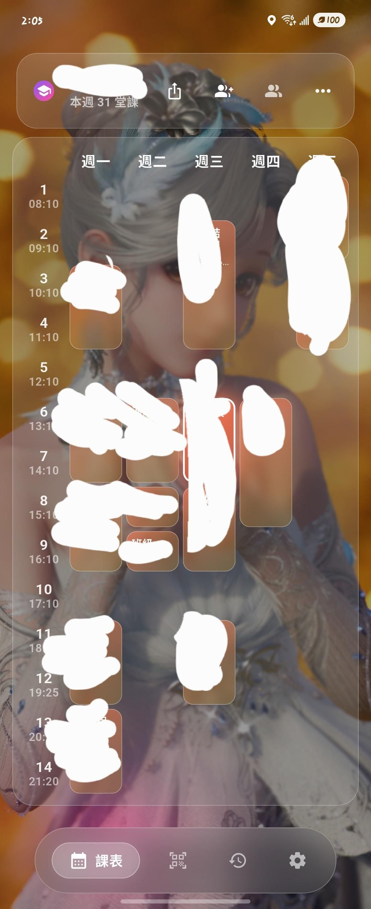
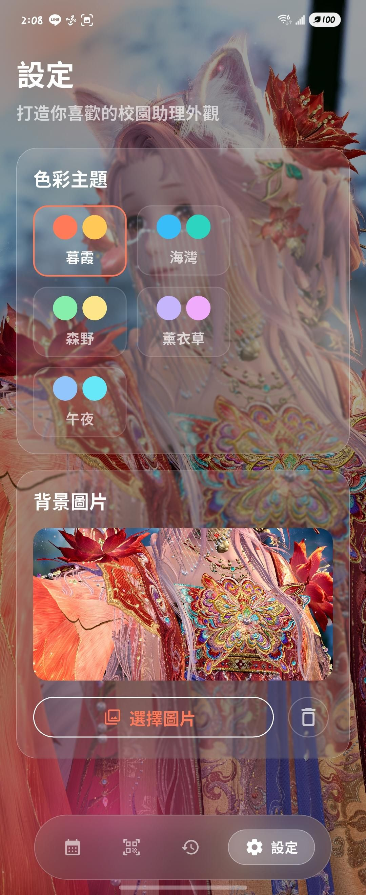

# 這不是行動逢甲

> 更好看的課表(也許。

---

## 📱 專案簡介

整合逢甲大學校務系統的第三方 App，提供：
- **視覺化課表**：連堂自動合併、進行中高光
- **好友課表分享**：一鍵匯出 / 匯入、同堂課好友頭像標記
- **可登多帳號**：支援多帳號
---

---

## 🖼 截圖

| 課表頁 | 打卡頁 |自訂背景 |
|---|---|---|
|  |  |    |

---

## 🚀 快速開始

### 去載apk

